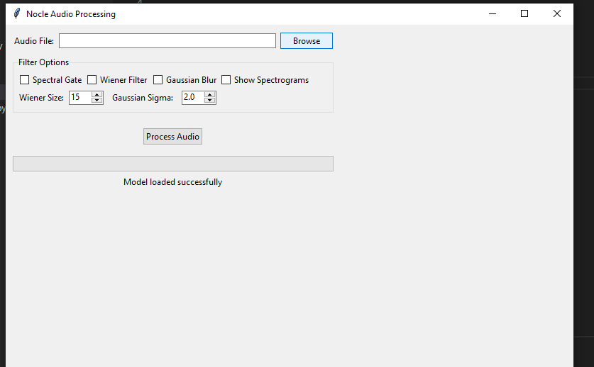
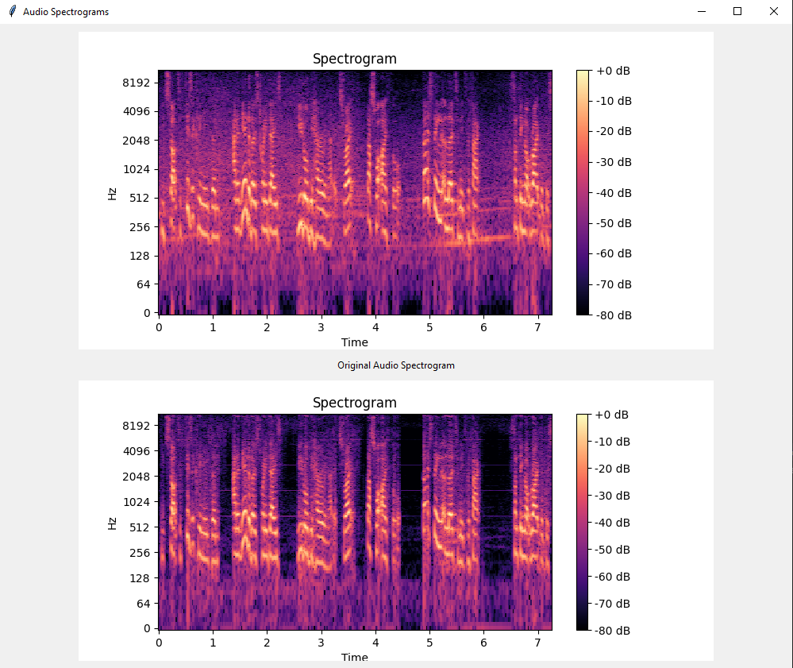

# Nocle - AI-Powered Audio Noise Reduction App

Nocle (Noise Cleaner) is a desktop application that uses artificial intelligence to reduce background noise in audio recordings. It provides a simple and user-friendly interface for cleaning up your audio files.




## Features

- AI-powered noise reduction
- Real-time audio playback
- Multiple audio filtering options
- Spectrogram visualization
- Easy-to-use interface
- WAV file support

## Installation

1. Make sure you have Python 3.10 or later installed
2. Clone this repository:
```bash
git clone https://github.com/haydarkadioglu/nocle-app.git
```
3. Create a virtual environment:
```bash
cd nocle-app
python -m venv .venv
```
4. Activate the virtual environment:
   - Windows:
   ```bash
   .venv\Scripts\activate
   ```
   - Linux/Mac:
   ```bash
   source .venv/bin/activate
   ```
5. Install required packages:
```bash
pip install -r requirements.txt
```

## How to Use

1. Launch the application:
```bash
python main.py
```

2. **Select Audio File**
   - Click the "Browse" button to select your WAV audio file
   - The original audio controls will appear


3. **Choose Filtering Options**
   - Spectral Gate: Reduces background noise
   - Wiener Filter: Reduces general noise
   - Gaussian Blur: Smooths audio signal
   - Adjust filter parameters as needed


4. **Process Audio**
   - Click "Process Audio" button
   - Wait for the processing to complete
   - New controls for the processed audio will appear

5. **Compare and Save**
   - Play both original and processed audio to compare
   - View spectrograms if enabled
   - Click "Save" to save the processed audio



## Understanding the Interface

### Main Controls
- **File Selection**: Top section for selecting input audio files
- **Filter Options**: Middle section for choosing and configuring filters
- **Audio Controls**: Bottom section showing playback controls
- **Progress Bar**: Shows processing progress
- **Status Messages**: Displays current operation status

### Filter Parameters
- **Wiener Size**: Controls the strength of the Wiener filter (3-31)
- **Gaussian Sigma**: Adjusts the smoothing effect (0.1-5.0)

### Audio Playback
- Play/Stop buttons for both original and processed audio
- Real-time playback time display
- Independent controls for comparing audio files

## Model Information

The application uses a custom-trained deep learning model for noise reduction:
- Model file: `nocle.hdf5`
- Input: Noisy WAV audio
- Output: Clean audio with reduced noise
- Sample rate: 16000 Hz

## Troubleshooting

### Common Issues

1. **Application won't start**
   - Check if Python 3.10+ is installed
   - Verify all dependencies are installed
   - Make sure virtual environment is activated

2. **Can't load audio file**
   - Ensure file is in WAV format
   - Check file permissions
   - Verify file isn't corrupted

3. **Processing fails**
   - Check if model file exists in model/ directory
   - Ensure enough system memory is available
   - Verify audio file is valid

## Contributing

1. Fork the repository
2. Create your feature branch
3. Commit your changes
4. Push to the branch
5. Create a Pull Request

## License

This project is licensed under the GNU License - see the LICENSE file for details.

## Authors

### Lead Developer
- **Haydar Kadıoğlu**
  - GitHub: [@haydarkadioglu](https://github.com/haydarkadioglu)
  - LinkedIn: [Haydar Kadıoğlu](https://www.linkedin.com/in/haydar-kadioglu/)

### Project Details
- **Latest Version**: 1.0.0
- **Status**: Active Development

### Contact
For questions, suggestions, or collaborations:
- Email: haydarkadioglu@gmail.com
- Project Issues: [GitHub Issues](https://github.com/haydarkadioglu/nocle-app/issues)

