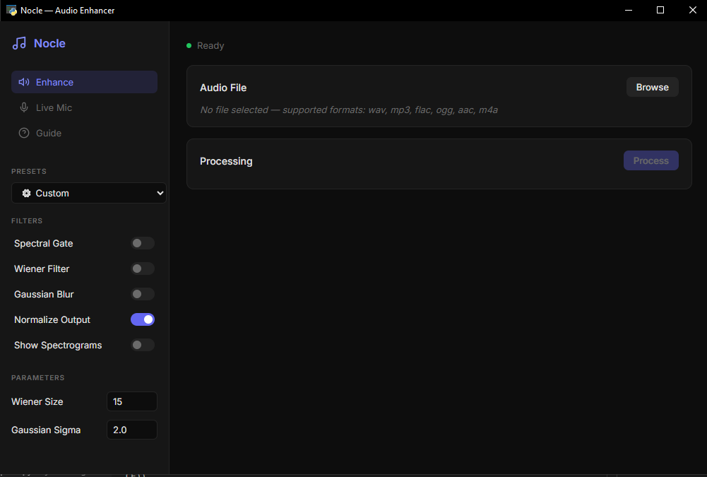

# Nocle — AI-Powered Audio Noise Reduction & Real-Time Mic App

Nocle (Noise Cleaner) is a desktop application powered by Deep Learning (TensorFlow) that removes background noise from audio files and real-time microphone streams. Built with a sleek, responsive HTML5/CSS3 interface powered by `pywebview`.



## ✨ Key Features

- **🎨 Modern Dark Mode UI:** Built with HTML5, CSS3, and JavaScript via `pywebview` for maximum responsiveness and visual excellence.
- **🎙️ Live Mic Real-Time Denoising:** Process live microphone input in real time and route clean audio to games, Discord, Zoom, or OBS via virtual audio cable.
- **🔊 Auto-set Default Microphone:** Automatically sets the virtual microphone as your Windows Default Recording Device on live stream start, and restores your physical microphone on stop.
- **📊 Live VU Level Meter:** Real-time visual audio peak meter displaying live volume levels.
- **🎛️ Filter Presets:** Quick 1-click filter presets (*Voice/Podcast*, *HVAC & Fan Noise*, *AI Clean Only*, *Aggressive Denoise*).
- **📁 Multi-Format Audio Support:** Supports `.wav`, `.mp3`, `.flac`, `.ogg`, `.aac`, and `.m4a` files via `librosa`.
- **🖱️ Drag & Drop:** Drop audio files directly into the app window.
- **⏩ Interactive Timeline Seeking:** Click anywhere on the playback timeline to jump instantly to any timestamp.
- **🧙 Automatic Setup Wizard:** Automatically detects missing drivers (like VB-Audio Cable) and installs them on first launch.
- **📖 Built-in Guide:** Explanations of filters and model workings directly inside the "Guide" tab.

---

## 🛠️ Installation

1. **Requirements:** Python 3.10 or later installed on Windows or Linux.
2. **Clone the repository:**
   ```bash
   git clone https://github.com/haydarkadioglu/nocle-app.git
   cd nocle-app
   ```
3. **Create & activate a virtual environment:**
   - **Windows (PowerShell):**
     ```powershell
     python -m venv .venv
     .venv\Scripts\activate
     ```
   - **Linux / macOS:**
     ```bash
     python3 -m venv .venv
     source .venv/bin/activate
     ```
4. **Install dependencies:**
   ```bash
   pip install -r requirements.txt
   ```

---

## 🚀 How to Use

Launch the application:
```bash
python main.py
```

### 1. Enhance Audio Files
1. Drag and drop or click **Browse** to choose an audio file (`.mp3`, `.wav`, `.flac`, `.ogg`, etc.).
2. Select a **Filter Preset** or customize individual filters (*Spectral Gate*, *Wiener Filter*, *Gaussian Blur*, *Normalize*).
3. Click **Process** and monitor progress in real time.
4. Compare original vs. processed audio with interactive seekable players.
5. Click **Save** to export the cleaned audio as a `.wav` file.

### 2. Live Mic (Real-Time Mode)
1. Navigate to the **Live Mic** tab.
2. Select your **Input Microphone** and **Output Device** (VB-Cable).
3. Choose your preferred latency buffer size (*Low Latency ~128ms*, *Balanced ~256ms*, *High Quality ~512ms*).
4. Click **Start Live Mic**. Your Windows default recording device will automatically switch to the cleaned virtual microphone!
5. Select **CABLE Output** in Discord, games, or streaming apps.

---

## 🏗️ Architecture & Technology Stack

- **GUI / Window Engine:** `pywebview`
- **Frontend:** Vanilla HTML5, CSS3 (CSS Variables, Flexbox, Inter Font), Vanilla JS
- **Audio Processing Engine:** Librosa, SciPy, SoundFile, SoundDevice
- **AI Denoising Model:** TensorFlow 2.x U-Net / GAN architecture (`nocle.hdf5`)
- **System Helper:** NirCmd for automatic Windows default audio endpoint switching

---

## 🤝 Contributing

Contributions, issues, and feature requests are welcome!
1. Fork the project
2. Create your feature branch (`git checkout -b feature/AmazingFeature`)
3. Commit your changes (`git commit -m 'Add some AmazingFeature'`)
4. Push to the branch (`git push origin feature/AmazingFeature`)
5. Open a Pull Request

See [CONTRIBUTING.md](CONTRIBUTING.md) for more details.

---

## 📄 License

Distributed under the GNU General Public License v3.0. See `LICENSE` for more information.

---

## 👤 Author

**Haydar Kadıoğlu**
- GitHub: [@haydarkadioglu](https://github.com/haydarkadioglu)
- LinkedIn: [Haydar Kadıoğlu](https://www.linkedin.com/in/haydarkadioglu/)
